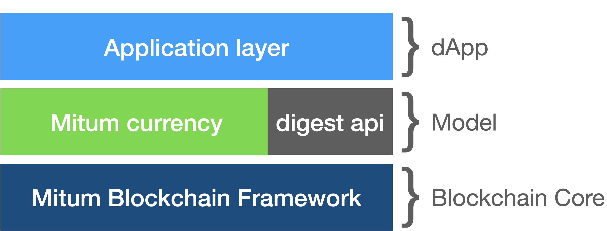

Introduction
==============

What is Mitum currency?
---------------------------

* Mitum currency is a currency model that operates on the Mitum blockchain networks.
* The Mitum model is a solution that can provide various services as an extension layer that extends the Mitum main chain.
* In Mitum currency, flexible policy settings related to currency issuance and operation are possible.
* `Mitum currency <https://github.com/spikeekips/mitum-currency>`_ is implemented based on `Mitum <https://github.com/spikeekips/mitum>`_ (blockchain core framework).
* See :ref:`technical spec` .

Mitum currency feature
--------------------------

* Mitum currency provides core features to meet the business needs of various fields related to tokens.
* Multiple keys can be registered when creating an account, and related keys can be replaced through key update operation.
* Mitum currency can issue new currency and related policy can be customized.
* Currency-related policy can be updated at any time as needed.
* Mitum currency has no compensation for block generation and there is also no inflation.
* The node configuration for the Mitum currency network follows the node operation policy of the Mitum blockchain, and details can be found at :ref:`test nodes`.

Digest Service
-----------------------

* Digest service is an internal service that stores block data stored by Mitum separately to serve as HTTP-based API.
* For more information on the Digest service, please refer to :ref:`api`.