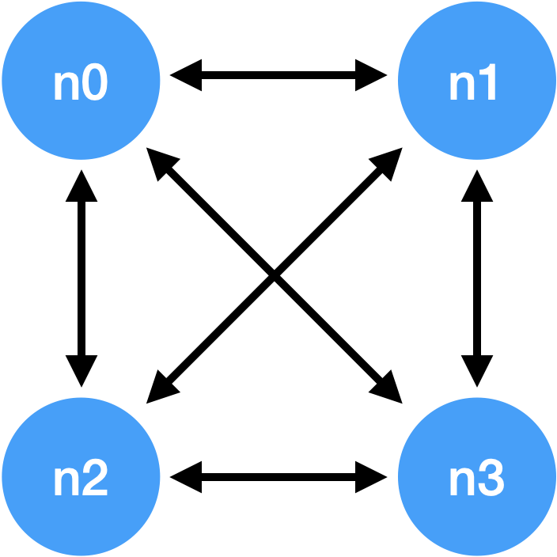
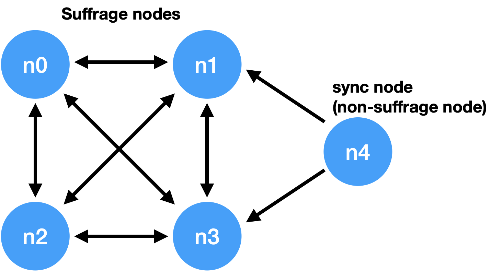

.. _test nodes:

Set up a Test Nodes
========================

Order of execution
--------------------------------------------------------------------------------

* When executing a multi node, the first node that creates the genesis block must be determined.
* The first node creates the genesis block through the node init command.
* Nodes other than the one that creates the genesis block do not need to execute the init command.
* The first node executes the node through the run command after init.
* Other nodes also execute each node through the run command.
* Other nodes follow the block of the first node through the sync process, and the nodes create blocks through the consensus process.
* If there are 4 nodes and n0 node is the first node, the execution order is as follows.

.. code-block:: sh

    # n0 node
    $ ./mc node init --log-level info ./n0.yml
    $ ./mc node run --log-level info ./n0.yml

.. code-block:: sh

    # n1 node
    $ ./mc node run --log-level info ./n1.yml

.. code-block:: sh

    # n2 node
    $ ./mc node run --log-level info ./n2.yml

.. code-block:: sh    

    # n3 node
    $ ./mc node run --log-level info ./n3.yml

.. note::

  * If running in the same network, nodes should have the same value for the next item in the configuration file.
  * ``genesis-operations``
  * ``network-id``

4 Suffrage nodes
-----------------------------

| In case of operating suffrage 4 nodes
| Prepare a separate yml configuration file for each node.
| n0, n1, n2, n3 are all suffrage nodes

Depending on the configuration of the node, it is necessary to configure the nodes participating in consensus.

.. code-block:: yaml

    # Only ``suffrage`` and ``nodes`` part of configuration of suffrage nodes
    
    suffrage:
        nodes:
            - n0:sa-v-0.0.1
            - n1:sa-v-0.0.1
            - n2:sa-v-0.0.1
            - n3:sa-v-0.0.1

    nodes:
        - address: n0:sa-v-0.0.1
          publickey: skRdC6GGufQ5YLwEipjtdaL2Zsgkxo3YCjp1B6w5V4bD:btc-pub-v0.0.1
          url: quic://127.0.0.1:54330?insecure=true
        - address: n1:sa-v-0.0.1
          publickey: ktJ4Lb6VcmjrbexhDdJBMnXPXfpGWnNijacdxD2SbvRM:btc-pub-v0.0.1
          url: quic://127.0.0.1:54331?insecure=true
        - address: n2:sa-v-0.0.1
          publickey: wfVsNvKaGbzB18hwix9L3CEyk5VM8GaogdRT4fD3Z6Zd:btc-pub-v0.0.1
          url: quic://127.0.0.1:54332?insecure=true
        - address: n3:sa-v-0.0.1
          publickey: vAydAnFCHoYV6VDUhgToWaiVEtn5V4SXEFpSJVcTtRxb:btc-pub-v0.0.1
          url: quic://127.0.0.1:54333?insecure=true

yml full configuration of all nodes.(example)

.. code-block:: yml

    # n0 node
    address: n0:sa-v-0.0.1
    genesis-operations:
        - account-keys:
              keys:
                  - publickey: rcrd3KA2wWNhKdAP8rHRzfRmgp91oR9mqopckyXRmCvG:btc-pub-v0.0.1
                    weight: 100
              threshold: 100
          currencies:
              - balance: "99999999999999999999"
                currency: MCC
          type: genesis-currencies
    network:
        bind: quic://0.0.0.0:54330
        url: quic://127.0.0.1:54330
    network-id: mitum
    policy:
        threshold: 100
    privatekey: Kxt22aSeFzJiDQagrvfXPWbEbrTSPsRxbYm9BhNbNJTsrbPbFnPA:btc-priv-v0.0.1
    publickey: skRdC6GGufQ5YLwEipjtdaL2Zsgkxo3YCjp1B6w5V4bD:btc-pub-v0.0.1
    storage:
        blockdata:
            path: ./n0_data/blockfs
        database:
            uri: mongodb://127.0.0.1:27017/n0_mc
    suffrage:
        nodes:
            - n0:sa-v-0.0.1
            - n1:sa-v-0.0.1
            - n2:sa-v-0.0.1
            - n3:sa-v-0.0.1
    nodes:
        - address: n1:sa-v-0.0.1
          publickey: ktJ4Lb6VcmjrbexhDdJBMnXPXfpGWnNijacdxD2SbvRM:btc-pub-v0.0.1
          url: quic://127.0.0.1:54331?insecure=true
        - address: n2:sa-v-0.0.1
          publickey: wfVsNvKaGbzB18hwix9L3CEyk5VM8GaogdRT4fD3Z6Zd:btc-pub-v0.0.1
          url: quic://127.0.0.1:54332?insecure=true
        - address: n3:sa-v-0.0.1
          publickey: vAydAnFCHoYV6VDUhgToWaiVEtn5V4SXEFpSJVcTtRxb:btc-pub-v0.0.1
          url: quic://127.0.0.1:54333?insecure=true

.. code-block:: yml

    # n1 node
    address: n1:sa-v-0.0.1
    genesis-operations:
        - account-keys:
              keys:
                  - privatekey: L5GTSKkRs9NPsXwYgACZdodNUJqCAWjz2BccuR4cAgxJumEZWjok:btc-priv-v0.0.1
                    publickey: rcrd3KA2wWNhKdAP8rHRzfRmgp91oR9mqopckyXRmCvG:btc-pub-v0.0.1
                    weight: 100
              threshold: 100
          currencies:
              - balance: "99999999999999999999"
                currency: MCC
          type: genesis-currencies
    network:
        bind: quic://0.0.0.0:54331
        url: quic://127.0.0.1:54331
    network-id: mitum
    policy:
        threshold: 100
    privatekey: L4R2AZVmxWUiF2FrNEFi6rHwCTdDLQ1JuQHji69SbMcmWUdNMUSF:btc-priv-v0.0.1
    publickey: ktJ4Lb6VcmjrbexhDdJBMnXPXfpGWnNijacdxD2SbvRM:btc-pub-v0.0.1
    storage:
        blockdata:
            path: ./n1_data/blockfs
        database:
            uri: mongodb://127.0.0.1:27018/n1_mc
    suffrage:
        nodes:
            - n0:sa-v-0.0.1
            - n1:sa-v-0.0.1
            - n2:sa-v-0.0.1
            - n3:sa-v-0.0.1
    nodes:
        - address: n0:sa-v-0.0.1
          publickey: skRdC6GGufQ5YLwEipjtdaL2Zsgkxo3YCjp1B6w5V4bD:btc-pub-v0.0.1
          url: quic://127.0.0.1:54330?insecure=true
        - address: n2:sa-v-0.0.1
          publickey: wfVsNvKaGbzB18hwix9L3CEyk5VM8GaogdRT4fD3Z6Zd:btc-pub-v0.0.1
          url: quic://127.0.0.1:54332?insecure=true
        - address: n3:sa-v-0.0.1
          publickey: vAydAnFCHoYV6VDUhgToWaiVEtn5V4SXEFpSJVcTtRxb:btc-pub-v0.0.1
          url: quic://127.0.0.1:54333?insecure=true

.. code-block:: yml

    # n2 node
    address: n2:sa-v-0.0.1
    genesis-operations:
        - account-keys:
              keys:
                  - publickey: rcrd3KA2wWNhKdAP8rHRzfRmgp91oR9mqopckyXRmCvG:btc-pub-v0.0.1
                    weight: 100
              threshold: 100
          currencies:
              - balance: "99999999999999999999"
                currency: MCC
          type: genesis-currencies
    network:
        bind: quic://0.0.0.0:54332
        url: quic://127.0.0.1:54332
    network-id: mitum
    policy:
        threshold: 100
    privatekey: L3Szj4t3w33YLsGFGeaB3v1vwae82yp5KWPcT7v1Y4WyQkAH7eCR:btc-priv-v0.0.1
    publickey: wfVsNvKaGbzB18hwix9L3CEyk5VM8GaogdRT4fD3Z6Zd:btc-pub-v0.0.1
    storage:
        blockdata:
            path: ./n2_data/blockfs
        database:
            uri: mongodb://127.0.0.1:27019/n2_mc
    suffrage:
        nodes:
            - n0:sa-v-0.0.1
            - n1:sa-v-0.0.1
            - n2:sa-v-0.0.1
            - n3:sa-v-0.0.1
    nodes:
        - address: n0:sa-v-0.0.1
          publickey: skRdC6GGufQ5YLwEipjtdaL2Zsgkxo3YCjp1B6w5V4bD:btc-pub-v0.0.1
          url: quic://127.0.0.1:54330?insecure=true
        - address: n1:sa-v-0.0.1
          publickey: ktJ4Lb6VcmjrbexhDdJBMnXPXfpGWnNijacdxD2SbvRM:btc-pub-v0.0.1
          url: quic://127.0.0.1:54331?insecure=true
        - address: n3:sa-v-0.0.1
          publickey: vAydAnFCHoYV6VDUhgToWaiVEtn5V4SXEFpSJVcTtRxb:btc-pub-v0.0.1
          url: quic://127.0.0.1:54333?insecure=true

.. code-block:: yml

    # n3 node
    address: n3:sa-v-0.0.1
    genesis-operations:
        - account-keys:
              keys:
                  - publickey: rcrd3KA2wWNhKdAP8rHRzfRmgp91oR9mqopckyXRmCvG:btc-pub-v0.0.1
                    weight: 100
              threshold: 100
          currencies:
              - balance: "99999999999999999999"
                currency: MCC
          type: genesis-currencies
    network:
        bind: quic://0.0.0.0:54333
        url: quic://127.0.0.1:54333
    network-id: mitum
    policy:
        threshold: 100
    privatekey: KwxfBSzwevSggJz2grf8FWrjvXzrctY3WismTy6GNdJpWXe5tF5L:btc-priv-v0.0.1
    publickey: vAydAnFCHoYV6VDUhgToWaiVEtn5V4SXEFpSJVcTtRxb:btc-pub-v0.0.1
    storage:
        blockdata:
            path: ./n3_data/blockfs
        database:
            uri: mongodb://127.0.0.1:27020/n3_mc
    suffrage:
        nodes:
            - n0:sa-v-0.0.1
            - n1:sa-v-0.0.1
            - n2:sa-v-0.0.1
            - n3:sa-v-0.0.1
    nodes:
        - address: n0:sa-v-0.0.1
          publickey: skRdC6GGufQ5YLwEipjtdaL2Zsgkxo3YCjp1B6w5V4bD:btc-pub-v0.0.1
          url: quic://127.0.0.1:54330?insecure=true
        - address: n1:sa-v-0.0.1
          publickey: ktJ4Lb6VcmjrbexhDdJBMnXPXfpGWnNijacdxD2SbvRM:btc-pub-v0.0.1
          url: quic://127.0.0.1:54331?insecure=true
        - address: n2:sa-v-0.0.1
          publickey: wfVsNvKaGbzB18hwix9L3CEyk5VM8GaogdRT4fD3Z6Zd:btc-pub-v0.0.1
          url: quic://127.0.0.1:54332?insecure=true

4 Suffrage nodes + 1 Sync node
-----------------------------------------------------

| In case of operating 4 suffrage nodes + 1 sync node(non-suffrage node)
| Prepare a separate yml configuration file for each node.
| n0, n1, n2, n3 are suffrage nodes and n4 is the sync node.

Only ``suffrage`` and ``nodes`` part of configuration of suffrage nodes(n0, n1, n2, n3).

.. code-block:: yaml

    suffrage:
        nodes:
            - n0:sa-v-0.0.1
            - n1:sa-v-0.0.1
            - n2:sa-v-0.0.1
            - n3:sa-v-0.0.1

    nodes:
        - address: n0:sa-v-0.0.1
          publickey: skRdC6GGufQ5YLwEipjtdaL2Zsgkxo3YCjp1B6w5V4bD:btc-pub-v0.0.1
          url: quic://127.0.0.1:54330?insecure=true
        - address: n1:sa-v-0.0.1
          publickey: ktJ4Lb6VcmjrbexhDdJBMnXPXfpGWnNijacdxD2SbvRM:btc-pub-v0.0.1
          url: quic://127.0.0.1:54331?insecure=true
        - address: n2:sa-v-0.0.1
          publickey: wfVsNvKaGbzB18hwix9L3CEyk5VM8GaogdRT4fD3Z6Zd:btc-pub-v0.0.1
          url: quic://127.0.0.1:54332?insecure=true
        - address: n3:sa-v-0.0.1
          publickey: vAydAnFCHoYV6VDUhgToWaiVEtn5V4SXEFpSJVcTtRxb:btc-pub-v0.0.1
          url: quic://127.0.0.1:54333?insecure=true

Only ``suffrage`` and ``nodes`` part of configuration of sync node(n4).

.. code-block:: yaml

    # suffrage and nodes part of configuration    

    suffrage:
        nodes:
            - n1:sa-v-0.0.1
            - n3:sa-v-0.0.1

    nodes:
        - address: n1:sa-v-0.0.1
          publickey: ktJ4Lb6VcmjrbexhDdJBMnXPXfpGWnNijacdxD2SbvRM:btc-pub-v0.0.1
          url: quic://127.0.0.1:54331?insecure=true
        - address: n3:sa-v-0.0.1
          publickey: vAydAnFCHoYV6VDUhgToWaiVEtn5V4SXEFpSJVcTtRxb:btc-pub-v0.0.1
          url: quic://127.0.0.1:54333?insecure=true

yml full configuration of all nodes.(example)

.. code-block:: yml

    # n0 node
    address: n0:sa-v-0.0.1
    genesis-operations:
        - account-keys:
              keys:
                  - publickey: rcrd3KA2wWNhKdAP8rHRzfRmgp91oR9mqopckyXRmCvG:btc-pub-v0.0.1
                    weight: 100
              threshold: 100
          currencies:
              - balance: "99999999999999999999"
                currency: MCC
          type: genesis-currencies
    network:
        bind: quic://0.0.0.0:54330
        url: quic://127.0.0.1:54330
    network-id: mitum
    policy:
        threshold: 100
    privatekey: Kxt22aSeFzJiDQagrvfXPWbEbrTSPsRxbYm9BhNbNJTsrbPbFnPA:btc-priv-v0.0.1
    publickey: skRdC6GGufQ5YLwEipjtdaL2Zsgkxo3YCjp1B6w5V4bD:btc-pub-v0.0.1
    storage:
        blockdata:
            path: ./n0_data/blockfs
        database:
            uri: mongodb://127.0.0.1:27017/n0_mc
    suffrage:
        nodes:
            - n0:sa-v-0.0.1
            - n1:sa-v-0.0.1
            - n2:sa-v-0.0.1
            - n3:sa-v-0.0.1
    nodes:
        - address: n1:sa-v-0.0.1
          publickey: ktJ4Lb6VcmjrbexhDdJBMnXPXfpGWnNijacdxD2SbvRM:btc-pub-v0.0.1
          url: quic://127.0.0.1:54331?insecure=true
        - address: n2:sa-v-0.0.1
          publickey: wfVsNvKaGbzB18hwix9L3CEyk5VM8GaogdRT4fD3Z6Zd:btc-pub-v0.0.1
          url: quic://127.0.0.1:54332?insecure=true
        - address: n3:sa-v-0.0.1
          publickey: vAydAnFCHoYV6VDUhgToWaiVEtn5V4SXEFpSJVcTtRxb:btc-pub-v0.0.1
          url: quic://127.0.0.1:54333?insecure=true

.. code-block:: yml

    # n1 node
    address: n1:sa-v-0.0.1
    genesis-operations:
        - account-keys:
              keys:
                  - publickey: rcrd3KA2wWNhKdAP8rHRzfRmgp91oR9mqopckyXRmCvG:btc-pub-v0.0.1
                    weight: 100
              threshold: 100
          currencies:
              - balance: "99999999999999999999"
                currency: MCC
          type: genesis-currencies
    network:
        bind: quic://0.0.0.0:54331
        url: quic://127.0.0.1:54331
    network-id: mitum
    policy:
        threshold: 100
    privatekey: L4R2AZVmxWUiF2FrNEFi6rHwCTdDLQ1JuQHji69SbMcmWUdNMUSF:btc-priv-v0.0.1
    publickey: ktJ4Lb6VcmjrbexhDdJBMnXPXfpGWnNijacdxD2SbvRM:btc-pub-v0.0.1
    storage:
        blockdata:
            path: ./n1_data/blockfs
        database:
            uri: mongodb://127.0.0.1:27018/n1_mc
    suffrage:
        nodes:
            - n0:sa-v-0.0.1
            - n1:sa-v-0.0.1
            - n2:sa-v-0.0.1
            - n3:sa-v-0.0.1
    nodes:
        - address: n0:sa-v-0.0.1
          publickey: skRdC6GGufQ5YLwEipjtdaL2Zsgkxo3YCjp1B6w5V4bD:btc-pub-v0.0.1
          url: quic://127.0.0.1:54330?insecure=true
        - address: n2:sa-v-0.0.1
          publickey: wfVsNvKaGbzB18hwix9L3CEyk5VM8GaogdRT4fD3Z6Zd:btc-pub-v0.0.1
          url: quic://127.0.0.1:54332?insecure=true
        - address: n3:sa-v-0.0.1
          publickey: vAydAnFCHoYV6VDUhgToWaiVEtn5V4SXEFpSJVcTtRxb:btc-pub-v0.0.1
          url: quic://127.0.0.1:54333?insecure=true

.. code-block:: yml

    # n2 node
    address: n2:sa-v-0.0.1
    genesis-operations:
        - account-keys:
              keys:
                  - publickey: rcrd3KA2wWNhKdAP8rHRzfRmgp91oR9mqopckyXRmCvG:btc-pub-v0.0.1
                    weight: 100
              threshold: 100
          currencies:
              - balance: "99999999999999999999"
                currency: MCC
          type: genesis-currencies
    network:
        bind: quic://0.0.0.0:54332
        url: quic://127.0.0.1:54332
    network-id: mitum
    policy:
        threshold: 100
    privatekey: L3Szj4t3w33YLsGFGeaB3v1vwae82yp5KWPcT7v1Y4WyQkAH7eCR:btc-priv-v0.0.1
    publickey: wfVsNvKaGbzB18hwix9L3CEyk5VM8GaogdRT4fD3Z6Zd:btc-pub-v0.0.1
    storage:
        blockdata:
            path: ./n2_data/blockfs
        database:
            uri: mongodb://127.0.0.1:27019/n2_mc
    suffrage:
        nodes:
            - n0:sa-v-0.0.1
            - n1:sa-v-0.0.1
            - n2:sa-v-0.0.1
            - n3:sa-v-0.0.1
    nodes:
        - address: n0:sa-v-0.0.1
          publickey: skRdC6GGufQ5YLwEipjtdaL2Zsgkxo3YCjp1B6w5V4bD:btc-pub-v0.0.1
          url: quic://127.0.0.1:54330?insecure=true
        - address: n1:sa-v-0.0.1
          publickey: ktJ4Lb6VcmjrbexhDdJBMnXPXfpGWnNijacdxD2SbvRM:btc-pub-v0.0.1
          url: quic://127.0.0.1:54331?insecure=true
        - address: n3:sa-v-0.0.1
          publickey: vAydAnFCHoYV6VDUhgToWaiVEtn5V4SXEFpSJVcTtRxb:btc-pub-v0.0.1
          url: quic://127.0.0.1:54333?insecure=true

.. code-block:: yml

    # n3 node
    address: n3:sa-v-0.0.1
    genesis-operations:
        - account-keys:
              keys:
                  - publickey: rcrd3KA2wWNhKdAP8rHRzfRmgp91oR9mqopckyXRmCvG:btc-pub-v0.0.1
                    weight: 100
              threshold: 100
          currencies:
              - balance: "99999999999999999999"
                currency: MCC
          type: genesis-currencies
    network:
        bind: quic://0.0.0.0:54333
        url: quic://127.0.0.1:54333
    network-id: mitum
    policy:
        threshold: 100
    privatekey: KwxfBSzwevSggJz2grf8FWrjvXzrctY3WismTy6GNdJpWXe5tF5L:btc-priv-v0.0.1
    publickey: vAydAnFCHoYV6VDUhgToWaiVEtn5V4SXEFpSJVcTtRxb:btc-pub-v0.0.1
    storage:
        blockdata:
            path: ./n3_data/blockfs
        database:
            uri: mongodb://127.0.0.1:27020/n3_mc
    suffrage:
        nodes:
            - n0:sa-v-0.0.1
            - n1:sa-v-0.0.1
            - n2:sa-v-0.0.1
            - n3:sa-v-0.0.1
    nodes:
        - address: n0:sa-v-0.0.1
          publickey: skRdC6GGufQ5YLwEipjtdaL2Zsgkxo3YCjp1B6w5V4bD:btc-pub-v0.0.1
          url: quic://127.0.0.1:54330?insecure=true
        - address: n1:sa-v-0.0.1
          publickey: ktJ4Lb6VcmjrbexhDdJBMnXPXfpGWnNijacdxD2SbvRM:btc-pub-v0.0.1
          url: quic://127.0.0.1:54331?insecure=true
        - address: n2:sa-v-0.0.1
          publickey: wfVsNvKaGbzB18hwix9L3CEyk5VM8GaogdRT4fD3Z6Zd:btc-pub-v0.0.1
          url: quic://127.0.0.1:54332?insecure=true

.. code-block:: yml

    # n4 node
    address: n4:sa-v-0.0.1
    genesis-operations:
        - account-keys:
              keys:
                  - publickey: rcrd3KA2wWNhKdAP8rHRzfRmgp91oR9mqopckyXRmCvG:btc-pub-v0.0.1
                    weight: 100
              threshold: 100
          currencies:
              - balance: "99999999999999999999"
                currency: MCC
          type: genesis-currencies
    network:
        bind: quic://0.0.0.0:54334
        url: quic://127.0.0.1:54334
    network-id: mitum
    policy:
        threshold: 67
    privatekey: KyKM3JtH8M9iBQrcFx4Lubi13Bg8pUPVYvxhihEfkiiqRRWYjjr4:btc-priv-v0.0.1
    publickey: 2BQkVjJpMdx4BFEhfTtf1oTaG4nLN148Dfax3ZnWybA2b:btc-pub-v0.0.1
    storage:
        blockdata:
            path: ./n4_data/blockfs
        database:
            uri: mongodb://127.0.0.1:27021/n4_mc
    suffrage:
        nodes:
            - n1:sa-v-0.0.1
            - n3:sa-v-0.0.1
    nodes:
        - address: n1:sa-v-0.0.1
          publickey: ktJ4Lb6VcmjrbexhDdJBMnXPXfpGWnNijacdxD2SbvRM:btc-pub-v0.0.1
          url: quic://127.0.0.1:54331?insecure=true
        - address: n3:sa-v-0.0.1
          publickey: vAydAnFCHoYV6VDUhgToWaiVEtn5V4SXEFpSJVcTtRxb:btc-pub-v0.0.1
          url: quic://127.0.0.1:54333?insecure=true